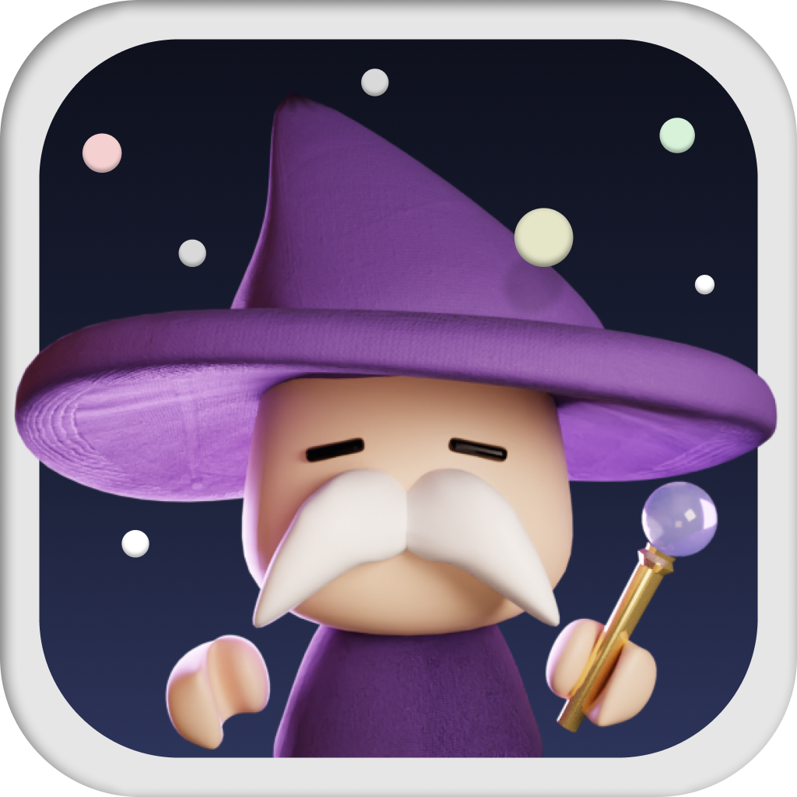

# Stella  
一款以遊戲化方式學習「創意思考」的 App

## 專案簡介
**Stella** 是一款將「靈感發想」轉化為互動體驗的 iOS 應用程式。  
透過 AI 主動提問與 3D 星球視覺化，幫助使用者練習如何思考、如何發問，並以可視化的方式組織想法，建立屬於自己的「創意宇宙」。

## 主要特色
- **AI 提問引導**：AI 根據使用者輸入的主題主動提出問題，幫助釐清思路。  
- **3D 創意宇宙**：將每個想法呈現為星球，主題為恆星，延伸構思為行星。  
- **遊戲化學習**：回答問題可獲得經驗值、成就與角色等級。  
- **思路地圖**：自動整理使用者的回答紀錄與思考路徑。

## 教學應用
Stella 可作為創意思考或設計課程的輔助教學工具：  
- 教師可觀察學生的發想歷程並引導思考。  
- 學生可透過互動過程練習發散與收斂思維，培養創意能力。

## 系統架構
| 模組 | 功能 | 技術 |
|------|------|------|
| 介面與視覺化 | 畫面設計與 3D 模型 | Unity |
| AI 導師 | 問題生成與引導 | ChatGPT API |
| 資料儲存 | 使用者資料、專案、經驗值 | Firebase |
| 平台 | 應用程式開發 | iOS |

## 使用說明
1. **登入帳號**：透過 Firebase 建立或登入帳號。  
2. **建立主題**：輸入想要發想的主題。  
3. **AI 提問互動**：逐步回答問題，累積經驗值。  
4. **建立星球模型**：為每個想法新增行星，擴展創意宇宙。  
5. **檢視思路地圖**：查看完整的思考流程與結果。

## 開發團隊
**隊伍名稱**：Wayne Studio  
**作品名稱**：Stella  

- 許昀韋 — 企劃、程式設計  
- 劉丞恩 — 程式設計、美術設計  

## 專案宗旨
Stella 以「遊戲化」方式讓創意思考更有趣、可練習、可視化。  
讓「發想」不只是靈感，而是一種可以被學習與訓練的能力。

